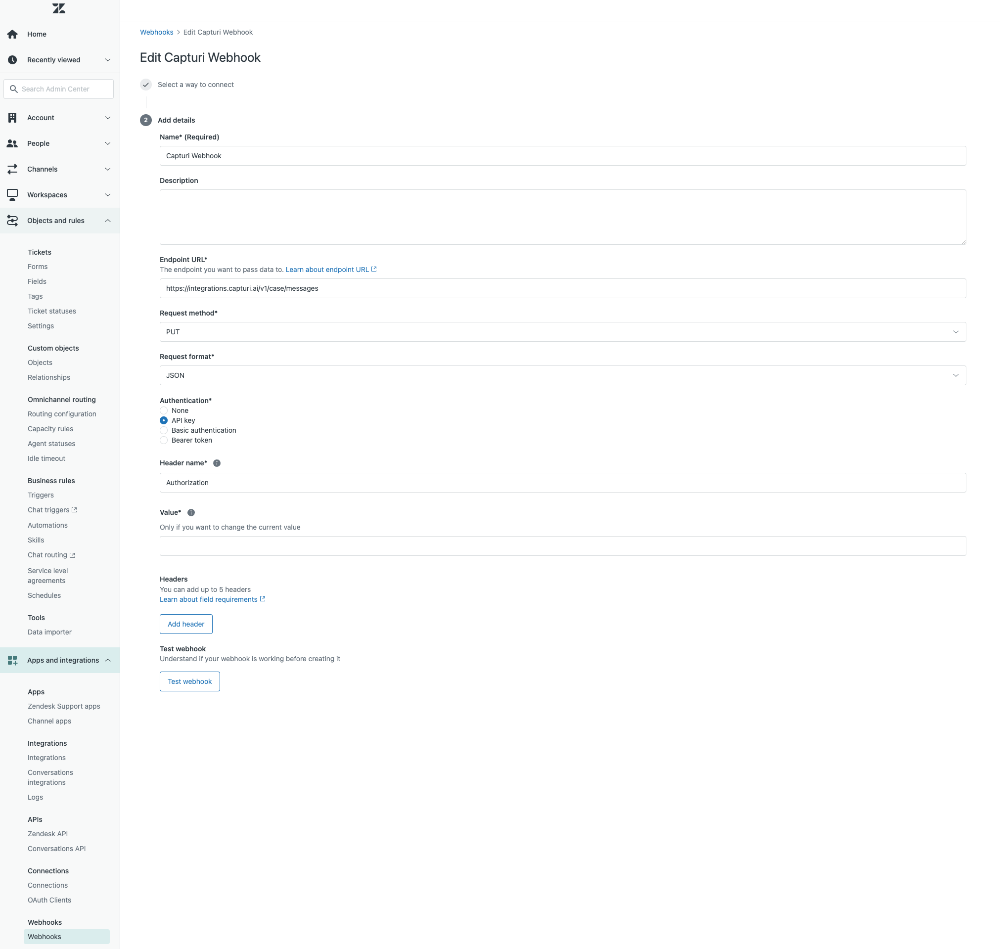

# Case Management API

REST API for creating, updating, and managing email/text cases in Capturi. Supports full CRUD operations with message threading and custom metadata fields.

## Base URL

```
https://integrations.capturi.ai
```

## Authentication

See [readme.md](readme.md#authentication) for authentication details.

## Implementation Notes

- Custom fields support arbitrary key-value metadata (max 10 fields)
- All timestamps must be ISO 8601 / RFC 3339 formatted
- HTML content is automatically stripped from message text
- Custom field names must be alphanumeric only (regex: `/^[a-zA-Z0-9]+$/`)
- Empty custom field values are silently ignored

---

## API Endpoints

### Create or Update Case

**`PUT /v1/case`**

Creates a new case or updates an existing one if a case with the given `caseUid` already exists. **Updating overwrites all existing fields** with the provided values.

#### Request Body

```json
{
  "caseUid": "case-12345",
  "source": "email-system",
  "created": "2024-01-15T10:00:00Z",
  "updated": "2024-01-15T10:00:00Z",
  "subject": "Customer Support Request",
  "inbox": "support@company.com",
  "status": "open",
  "priority": "high",
  "tags": ["support", "urgent"],
  "customFields": [
    { "name": "customerType", "value": "premium" },
    { "name": "productVersion", "value": "2.1.0" }
  ],
  "messages": [
    {
      "messageUid": "msg-001",
      "created": "2024-01-15T10:00:00Z",
      "type": "email",
      "direction": "Inbound",
      "from": {
        "name": "John Customer",
        "email": "john@customer.com",
        "id": "cust-123"
      },
      "to": [
        {
          "name": "Support Team",
          "email": "support@company.com",
          "id": "support-team"
        }
      ],
      "subject": "Help with login issues",
      "text": "I'm having trouble logging into my account...",
      "attachments": ["screenshot-login-error.png"]
    }
  ]
}
```

#### Field Reference

| Field | Type | Required | Description |
|-------|------|----------|-------------|
| `caseUid` | string | ✅ | Unique case identifier from your system |
| `source` | string | ✅ | Source system identifier |
| `created` | string (ISO 8601) | ✅ | When the case was created |
| `updated` | string (ISO 8601) | ✅ | When the case was last updated |
| `subject` | string | ✅ | Case subject |
| `inbox` | string | ❌ | Target inbox/routing |
| `status` | string | ❌ | Case lifecycle status |
| `priority` | string | ❌ | Business priority level |
| `tags` | string[] | ❌ | Classification labels |
| `customFields` | object[] | ❌ | Max 10 fields, alphanumeric keys only |
| `messages` | Message[] | ✅ | At least one message required |

#### Message Object

| Field | Type | Required | Description |
|-------|------|----------|-------------|
| `messageUid` | string | ✅ | Unique message ID |
| `created` | string (ISO 8601) | ✅ | When the message was created |
| `type` | string | ❌ | Message type identifier (e.g. `"email"`) |
| `direction` | string | ✅ | `"Inbound"` or `"Outbound"` |
| `from` | Contact | ✅ | Sender information |
| `to` | Contact[] | ✅ | Recipient(s) |
| `subject` | string | ❌ | Message subject |
| `text` | string | ✅ | Message body (HTML is automatically stripped) |
| `attachments` | string[] | ❌ | File reference IDs |

#### Contact Object

| Field | Type | Required | Description |
|-------|------|----------|-------------|
| `name` | string | ✅ | Contact display name |
| `email` | string | ✅ | Contact email address |
| `id` | string | ⚠️ | Contact identifier. **Required** on `from` for **outbound** messages (used to create/look up the sending agent — an empty value is rejected with `400`). Ignored on `from` for inbound messages and on all `to` contacts. |

#### Response

- **200 OK** on success

> **Note:** For outbound messages, the `from.id`, `from.email`, and `from.name` fields are used to create or look up the agent in Capturi.

---

### Add Message and Create Case If Not Exists

**`PUT /v1/case/messages`**

Adds a single message to a case. If the case doesn't exist, it will be created. **Case metadata fields are overwritten** if the case already exists.

#### Request Body

```json
{
  "caseUid": "case-12345",
  "source": "email-system",
  "created": "2024-01-15T11:00:00Z",
  "updated": "2024-01-15T11:00:00Z",
  "subject": "Customer Support Request",
  "inbox": "support@company.com",
  "status": "in-progress",
  "tags": ["support"],
  "customFields": [
    { "name": "priority", "value": "high" }
  ],
  "message": {
    "messageUid": "msg-002",
    "created": "2024-01-15T11:00:00Z",
    "type": "email",
    "direction": "Outbound",
    "from": {
      "name": "Support Agent",
      "email": "agent@company.com",
      "id": "agent-456"
    },
    "to": [
      {
        "name": "John Customer",
        "email": "john@customer.com",
        "id": "cust-123"
      }
    ],
    "subject": "Re: Help with login issues",
    "text": "Hi John, I can help you with the login issue...",
    "attachments": []
  }
}
```

> **Note:** This endpoint uses `"message"` (singular) unlike the PUT `/v1/case` endpoint which uses `"messages"` (plural array).

#### Field Reference

Same case-level fields as the Create or Update endpoint above, plus a single `message` object (same schema as the Message Object).

#### Response

- **200 OK** on success

---

### Add Message to Existing Case

**`POST /v1/case/messages`**

Adds a message to an existing case. The response reflects the status returned by the downstream case service — if the case doesn't exist, expect a non-2xx status. Use `PUT /v1/case/messages` if you want the case created when it's missing.

#### Request Body

```json
{
  "caseUid": "case-12345",
  "message": {
    "messageUid": "msg-003",
    "created": "2024-01-15T12:00:00Z",
    "type": "email",
    "direction": "Inbound",
    "from": {
      "name": "John Customer",
      "email": "john@customer.com",
      "id": "cust-123"
    },
    "to": [
      {
        "name": "Support Agent",
        "email": "agent@company.com",
        "id": "agent-456"
      }
    ],
    "subject": "Re: Help with login issues",
    "text": "Thank you! That fixed the issue.",
    "attachments": []
  }
}
```

| Field | Type | Required | Description |
|-------|------|----------|-------------|
| `caseUid` | string | ✅ | Case to add the message to |
| `message` | Message | ✅ | The message to add (see Message Object above) |

#### Response

- **200 OK** on success
- A non-2xx status if the case doesn't exist (propagated from the case service)

---

### Patch Case

**`PATCH /v1/case/{externalID}`**

Patches an existing case. Only fields present in the request body are updated — missing fields are left unchanged.

#### Request Body

```json
{
  "updated": "2024-01-15T13:00:00Z",
  "status": "resolved",
  "subject": "Updated subject",
  "inbox": "resolved@company.com",
  "tags": ["resolved", "support"],
  "customFields": [
    { "name": "resolutionTime", "value": "3 hours" },
    { "name": "satisfaction", "value": "5" }
  ],
  "onlyUpdateCustomFields": false,
  "messages": [
    {
      "externalUid": "msg-004",
      "created": "2024-01-15T13:00:00Z",
      "type": "Outbound",
      "from": {
        "email": "agent@company.com",
        "name": "Support Agent"
      },
      "to": [
        {
          "email": "john@customer.com",
          "name": "John Customer"
        }
      ],
      "subject": "Case resolved",
      "text": "Your case has been resolved."
    }
  ]
}
```

| Field | Type | Required | Description |
|-------|------|----------|-------------|
| `externalUid` | string | ❌ | External UID override |
| `updated` | string (ISO 8601) | ❌ | Updated timestamp |
| `subject` | string | ❌ | Case subject |
| `inbox` | string | ❌ | Target inbox |
| `status` | string | ❌ | Case status |
| `tags` | string[] | ❌ | Classification labels (replaces existing) |
| `customFields` | object[] | ❌ | Custom fields to update |
| `onlyUpdateCustomFields` | bool | ❌ | When `true`, only custom fields are updated |
| `messages` | object[] | ❌ | Messages to add/update |

#### Response

- **200 OK** on success

---

## Zendesk Integration Example

### Webhook Setup

Create a webhook pointing to this URL using a **PUT** request:

```
https://integrations.capturi.ai/v1/case/messages
```

Select API key authentication, set the header to `"Authorization"` and input the API key from Capturi.



### Trigger Setup

Create two triggers sending all creates and updates to the webhook. Create a condition that filters on either "End-user" and "Agent".

The first trigger should set direction to `"Inbound"`, the other to `"Outbound"`.

Use the following template (fields can be modified, but the provided fields are required):

```json
{
  "caseUid": "{{ticket.id}}",
  "created": "{{ticket.created_at_with_timestamp}}",
  "inbox": "{{ticket.group.name}}",
  "message": {
    "direction": "Inbound",
    "created": "{{ticket.updated_at_with_timestamp}}",
    "from": {
      "email": "{{ticket.latest_comment.author.email}}",
      "id": "{{ticket.latest_comment.author.id}}",
      "name": "{{ticket.latest_comment.author.name}}"
    },
    "messageUid": "{{ticket.latest_comment.id}}",
    "subject": "{{ticket.title}}",
    "text": "{{ticket.latest_comment.value}}",
    "to": [
      {
        "email": "{{ticket.assignee.email}}",
        "id": "{{ticket.assignee.id}}",
        "name": "{{ticket.assignee.name}}"
      }
    ]
  },
  "priority": "{{ticket.priority}}",
  "source": "{{ticket.via}}",
  "status": "{{ticket.status}}",
  "subject": "{{ticket.title}}",
  "updated": "{{ticket.updated_at_with_timestamp}}"
}
```

---

## Error Handling

| Status Code | Description |
|-------------|-------------|
| 200 | Success |
| 400 | Bad Request — Invalid JSON, missing required fields, or validation errors |
| 409 | Conflict — `caseUid` already exists |
| 500 | Internal Server Error — Downstream service issues |
