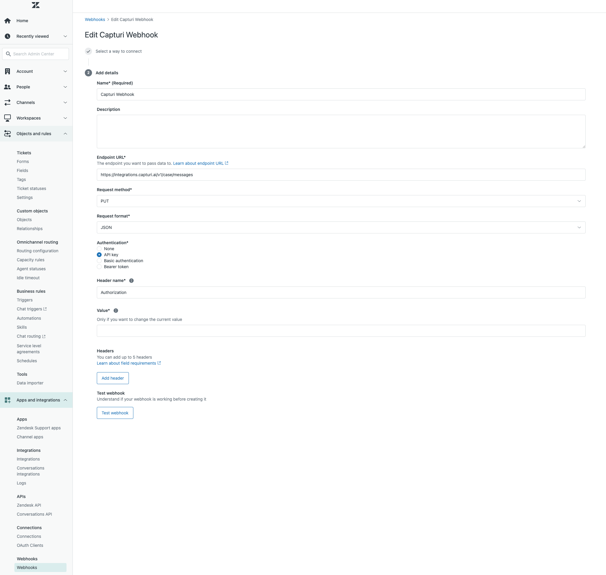

# Capturi Integrations demo clients

This repository contains demo applications for capturi integrations api. 

Swagger docs are available at  https://integrations.capturi.ai/swagger/index.html

To get an api token or if you have technical questions contact us at integrations@capturi.com, you are also welcome to create an issue on github.


# API Documentation

## Auth

The token must be provided in either the "Authorization" header (recommended, as it won't show up i etc. firewall logs), or as a query parameter. ```?api-token=```

## Endpoints

The base url is https://integrations.capturi.ai

### Create conversation

External-id should be a unique id for each call/conversation

* Path: /v1/conversation
* Method: POST
* Content-Type: json
* Model:  
   ```
  { 
    externalId: "string", //required
    numberOfSpeakers: int, //required
    phoneNumber: "string", //required
    title: "string", //required
    labels: ["string", "array"],
    datetime: datetime, //required
    outcome: "string", 
    outcomeReason: "string",
    agentId : "string", //required
    agentName: "string", //required 
    agentEmail: "string", //required    
    caseId: "string"  
  }
  ```
* Returns: Capturi conversation id.

## V2 endpoint

The V2 endpoint supports more custom properties and is more closely tied to the underlying conversation model. To upgrade from V1 use the following mappings:

externalId => externalIdentity
numberOfSpeakers => audioChannels (default is "stereo" so if your audio file is stereo you can omit this property. Other options are "Mono1Speaker" or "Mono2Speaker")
phoneNumber => customer
title => subject
outcome => CustomProp1
outcomeReason => CustomProp2
caseId => CustomProp3

### Added 

customerCompany 
customProp4-10 (for string values)
customNumberProp1-10 (for numbers)

### Audio
 
* Path: /v1/audio/{capturi-conversation-id}
* Method: POST / MultiPart file upload
* Model: File must be added to the form in a key called "data"
* Returns: OK

* Path: /v1/audio/external/{external-id} //external-id, must be the same as used in create conversation endpoint.
* Method: POST / MultiPart file upload
* Model: File must be added to the form in a key called "data"
* Returns: OK


### Case

#### Zendesk webhook example

Create a webhook pointing to this URL using a PUT request.

https://integrations.capturi.ai/v1/case/messages

Select api key authentication, set header to "Authorization" and input api key from Capturi



Create two triggers sending all creates and updates to the above webhook. Create a condition that filters on either "End-user" and "Agent"

The first should set direction to "inbound" the other to "outbound"


Use the following template (can be modified as suited, but the provided fields are required)

```json
{
  "caseUid": "{{ticket.id}}",
  "created": "{{ticket.created_at_with_timestamp}}",
  "inbox": "{{ticket.group.name}}",
  "message": {
    "direction" : "inbound",
    "created": "{{ticket.updated_at_with_timestamp}}",
    "from": {
      "email": "{{ticket.latest_comment.author.email}}",
      "id": "{{ticket.latest_comment.author.id}}",
      "name": "{{ticket.latest_comment.author.name}}"
    },
    "messageUid": "{{ticket.latest_comment.id}}",
    "subject": "{{ticket.title}}",
    "text": "{{ticket.latest_comment.value}}",
    "to": [
      {
        "email": "{{ticket.assignee.email}}",
        "id": "{{ticket.assignee.id}}",
        "name": "{{ticket.assignee.name}}"
      }
    ]
  },
  "priority": "{{ticket.priority}}",
  "source": "{{ticket.via}}",
  "status": "{{ticket.status}}",
  "subject": "{{ticket.title}}",
  "updated": "{{ticket.updated_at_with_timestamp}}"
}


