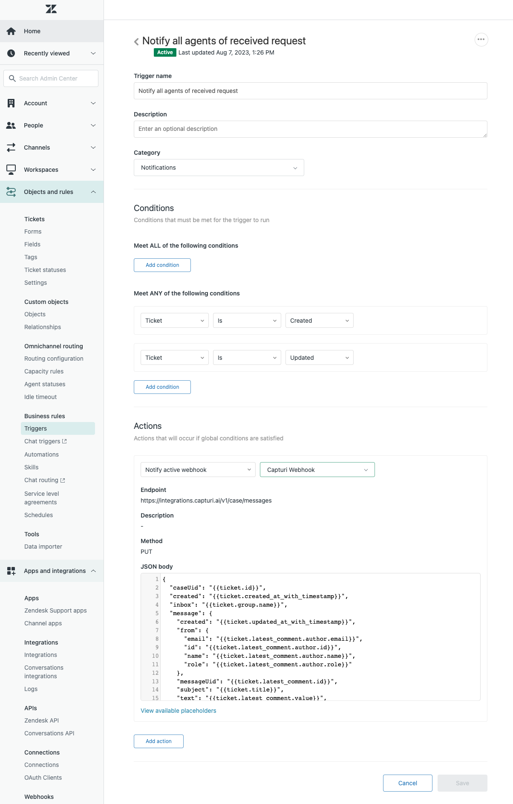

# Capturi Integrations demo clients

This repository contains demo applications for capturi integrations api. 

Swagger docs are available at  https://integrations.capturi.ai/swagger/index.html

To get an api token or if you have technical questions contact us at integrations@capturi.com, you are also welcome to create an issue on github.


# API Documentation

## Auth

The token must be provided in either the "Authorization" header (recommended, as it won't show up i etc. firewall logs), or as a query parameter. ```?api-token=```

## Endpoints

The base url is https://integrations.capturi.ai

### Create conversation

* Path: /v2/conversation
* Method: POST
* Content-Type: json
* Model:

```
{
  "agentEmail": "schmidt@capturi.com", //required
  "agentId": "1234", //required
  "agentName": "Agent Schmidt", //required
  "audioChannels": "Mono1Speaker, Mono2Speaker, Stereo", //optional - Stereo is default
  "customNumberProp1": 0, //optional 
  "customNumberProp10": 0, //optional 
  "customNumberProp2": 0, //optional 
  "customNumberProp3": 0, //optional 
  "customNumberProp4": 0, //optional 
  "customNumberProp5": 0, //optional 
  "customNumberProp6": 0, //optional 
  "customNumberProp7": 0, //optional 
  "customNumberProp8": 0, //optional 
  "customNumberProp9": 0, //optional 
  "customProp1": "Some custom data - must be configured in capturi", //optional 
  "customProp10": "string", //optional 
  "customProp2": "string", //optional  
  "customProp3": "string", //optional 
  "customProp4": "string", //optional 
  "customProp5": "string", //optional 
  "customProp6": "string", //optional 
  "customProp7": "string", //optional 
  "customProp8": "string", //optional 
  "customProp9": "string", //optional 
  "customer": "+4522446688", //required
  "customerCompany": "Capturi", //optional 
  "dateTime": "string", //required
  "externalIdentity": "1234 id from external system - must be unique", //required
  "conversationSegments": [
  {
      "durationSeconds": 25,
      "startSeconds": 10
  }
  ],// optional
  "labels": [
    "Inbound",
    "callback"
  ], //optional 
  "salesPersonAudioChannel": 1, //optional (1 for left(default), 2 for right) 
  "status": "closed", //optional 
  "subject": "Customer service queue 1", //required
  "teamName" : "Team 1", // Optional
  "hasConsent" : true //optional defaults to true. Conversations with this set to false will be analysed, insights will anonymised and kept and the recording will be deleted. 
}
```

#### V2 changes

```
externalId => externalIdentity
numberOfSpeakers => audioChannels 
phoneNumber => customer
title => subject
outcome => CustomProp1
outcomeReason => CustomProp2
caseId => CustomProp3
```
#### Added 

```
salesPersonAudioChannel 
customerCompany 
customProp4-10 
customNumberProp1-10
team
conversationSegments
```

### Audio
 
* Path: /v1/audio/{capturi-conversation-id}
* Method: POST / MultiPart file upload
* Model: File must be added to the form in a key called "data"
* Returns: OK

* Path: /v1/audio/external/{external-id} //external-id, must be the same as used in create conversation endpoint.
* Method: POST / MultiPart file upload
* Model: File must be added to the form in a key called "data"
* Returns: OK


### Case

#### Zendesk webhook example

Create a webhook pointing to this URL using a PUT request.

https://integrations.capturi.ai/v1/case/messages

Select api key authentication, set header to "Authorization" and input api key from Capturi


Create two triggers sending all creates and updates to the above webhook. Create a condition that filters on either "End-user" and "Agent"

The first should set direction to "inbound" the other to "outbound"



Use the following template (can be modified as suited, but the provided fields are required)

```json
{
  "caseUid": "{{ticket.id}}",
  "created": "{{ticket.created_at_with_timestamp}}",
  "inbox": "{{ticket.group.name}}",
  "message": {
    "direction" : "inbound",
    "created": "{{ticket.updated_at_with_timestamp}}",
    "from": {
      "email": "{{ticket.latest_comment.author.email}}",
      "id": "{{ticket.latest_comment.author.id}}",
      "name": "{{ticket.latest_comment.author.name}}"
    },
    "messageUid": "{{ticket.latest_comment.id}}",
    "subject": "{{ticket.title}}",
    "text": "{{ticket.latest_comment.value}}",
    "to": [
      {
        "email": "{{ticket.assignee.email}}",
        "id": "{{ticket.assignee.id}}",
        "name": "{{ticket.assignee.name}}"
      }
    ]
  },
  "priority": "{{ticket.priority}}",
  "source": "{{ticket.via}}",
  "status": "{{ticket.status}}",
  "subject": "{{ticket.title}}",
  "updated": "{{ticket.updated_at_with_timestamp}}"
}


